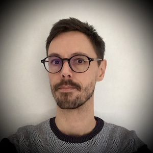

{: #img-thumbnail}

**Florian Boudin** 
&#102;&#108;&#111;&#114;&#105;&#097;&#110;&#046;&#098;&#111;&#117;&#100;&#105;&#110;&#064;&#117;&#110;&#105;&#118;&#045;&#110;&#097;&#110;&#116;&#101;&#115;&#046;&#102;&#114;
{: .decalage}

I am Associate Professor ([HDR](https://theses.hal.science/tel-04137160)) of Computer Science at Nantes University.
My [research]({{ site.baseurl }}/research/) lies within the fields of Natural Language Processing (NLP) and Information Retrieval (IR).
My main research interests are weakly supervised/unsupervised learning and graph-based approaches with applications including keyphrase extraction and generation, summarization and document retrieval in scholarly collections.
I'm doing research at the [LS2N Lab](http://www.ls2n.fr) in the [TALN group](http://taln.ls2n.fr) and I do some [teaching]({{ site.baseurl }}/teaching/) too.
Currently, I held a research leave at the [JFLI lab](https://jfli.cnrs.fr/) in Tokyo.
{: .decalage}

**trajectory:** grad student at [LIA, Université d'Avignon](http://lia.univ-avignon.fr) &rarr; post-doc at [RALI, Université de Montréal](http://rali.iro.umontreal.ca) &rarr; associate professor at [LS2N, Université de Nantes](http://www.ls2n.fr) &rarr; visiting researcher at [Aizawa lab, National Institute of Informatics](http://www-al.nii.ac.jp/) &rarr; researcher at [JFLI, National Institute of Informatics](https://jfli.cnrs.fr/).
{: .decalage}